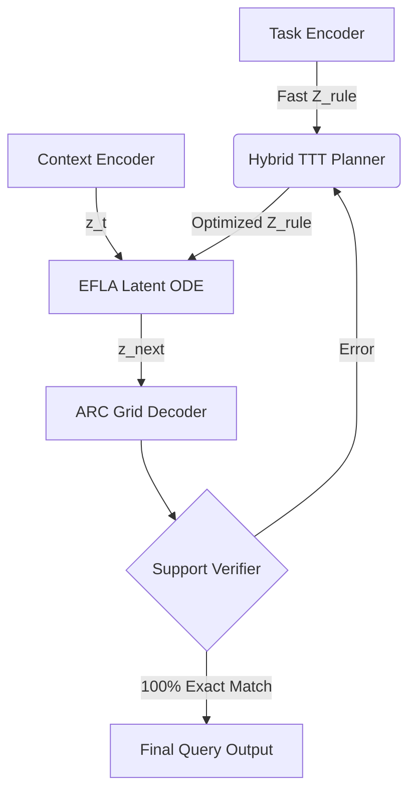

# SEF-GRAM: System 2 Latent Reasoning for ARC-AGI

**TL;DR:** Первая likelihood-free архитектура для решения ARC-AGI, объединяющая Continuous-Time ODE (EFLA), Gradient-based Latent Planning (BJEPA) и Test-Time Training (TTT) со строгой пиксельной верификацией.

## 🧠 Why it matters
Классические генеративные модели (AR/VAE) неизбежно проваливаются на ARC-AGI из-за "Пиксельного Парадокса" (Pixel Accuracy Fallacy). Авторегрессионные модели накапливают ошибки, а декодеры не могут точно восстановить дискретную логику 100% Exact Match. SEF-GRAM решает это фундаментально:
1. **Обучение без предсказания пикселей:** (Likelihood-free VJEPA) Сеть учит логику преобразований, а не цвета.
2. **Абстрактный градиентный поиск правил:** $Z_{rule}$ оптимизируется на этапе инференса.
3. **Жесткая пиксельная верификация:** Подтверждение гипотез (Support Verifier) только через 100% совпадение.

## 🧩 Архитектура



**Ключевые компоненты:**
- **System 1 (Amortized Task Encoder):** Быстрое предсказание концепта (Slot Memory) из Support-сета. Дает `warm-start` для TTT.
- **System 2 (Hybrid TTT Planner):** BJEPA градиентный спуск по `Z_rule` (64-512 параллельных гипотез).
- **Latent Physics (EFLA & Diffusion-GRAM):** Динамика в непрерывном пространстве с "магнитными аттракторами" (L2 штрафы к словарю концептов). Удерживает пространственную логику $30\times30$ без потерь при итерациях.
- **Support Verifier & Decoder TTFT:** Жесткая дискретная отбраковка гипотез на Support-примерах + адаптация Декодера Test-Time Fine-Tuning.

## 🚀 Запуск на Кластере (Scaling Phase)
Пайплайн поддерживает **Тотальную Аугментацию** (D4 Symmetry & Color Permutations) для достижения инвариантности к цветам и пространственной топологии.

Инструкции по развертыванию на A100/H100:
1. Масштабируйте Test-Time Compute до 512 гипотез и 50 шагов Adam на инференсе.
2. Контролируйте переход этапов Curriculum Learning строго по метрике `Latent Continuity Cosine` > 0.95.

```bash
# 1. Meta-Pretraining Backbone (Phase 5.3)
python experiments/run_step5_3_rearc.py

# 2. Linear Probing Decoder (Phase 5.4)
python experiments/run_step5_4_train_decoder.py

# 3. Full Verification & Evaluation (Phase 6)
python experiments/run_step6_final_eval.py
```
